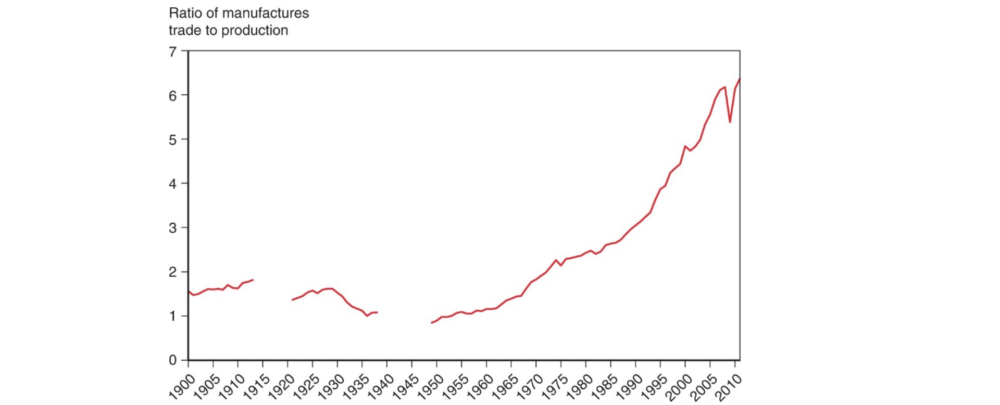
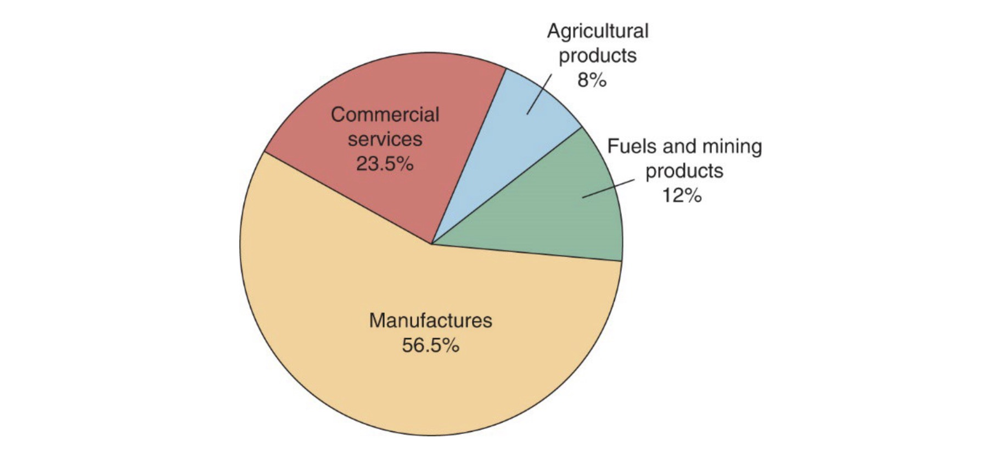
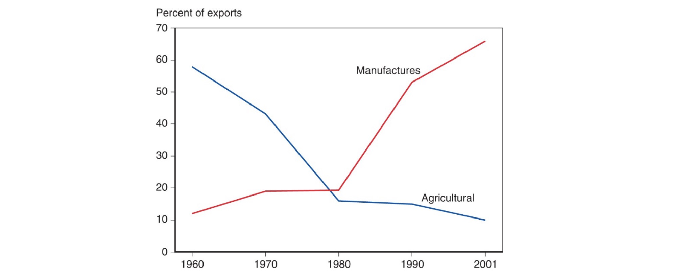

# 20.04.2023 International Economics

Learning Objectives:

- international and domestic economic issues
- recurring themes
- trade / monetary distinguish  

> **International Economics**: How nations interact trough ***trade*** (of goods and services) and ***finance*** (flows of money and investment)

History of Trade:

## Gravity Model

How much do people trade with each other? 

$$
T_ij = \frac{A \times Y_i \times Y_j}{D_{ij}}
$$

- A = constant term
- D = Distance
- Y = GDP of respective country

Anomalies: (EU and US)

- Ireland = cultural affinity
- Netherlands = transport cost advantages

=> more Trade than predicted

other Aspects (not in Model):

- cultural affinity
- geography
- Multinational Corps.
- Borders

## Trade Products

mostly manufactured goods

changes especially in developing countries:

- historical: agricultural products
- now: manufactured goods

## Service Outsourcing

in US, currently not significant

- most jobs are **not tradable**
- the tradable jobs are still often in the US

