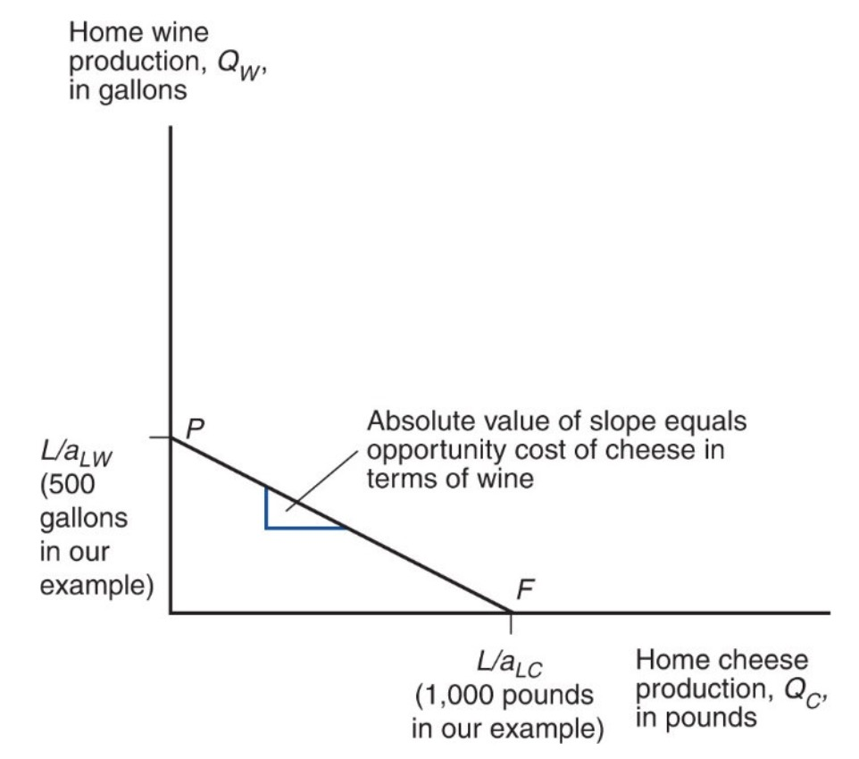
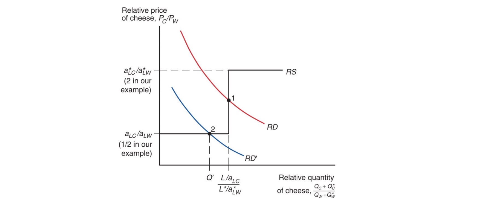

# 27.04.2023 Labor Productivity

why does Trade exist?

## Ricardian Model

Comparative Advantages in Productivity of Labor

> **Opportunity Cost:** Cost of next best Alternative

Comparative Advantage: Country with lower Opportunity Costs of Product

Example:

- US: same resources can produce 10mil Roses and 100k computers
- Colombia: same resources $\to$ 10mil Roses and 30k computers

Colombia = lower opportunity cost of computers => comp. Advantage in Roses

| without Trade | Roses       | Computers     |
| ------------- | ----------- | ------------- |
| US            | 5mil Roses  | 15k Computers |
| Colombia      | 5 mil Roses | 50k Computers |

| with Trade |              |                 |
| ---------- | ------------ | --------------- |
| US         | 10 mil Roses | 0               |
| Colombia   | 0            | 100 k Computers |

=> 35k Computers more

## One Factor Economy

#### Assumptions

- labor = only factor of Production
- labor prod. varies across countries
- supply of labor = constant in country
- two goods: wine and cheese
- competition means wages = productivity
- two countries: home and foreign

#### Model Definition

- $a_L$: unit labor requirement = labor needed for one product
    - $a_{LC}$ = hours needed for cheese in home country
    - $a_{LW}$ = same for wine
- *L*: labor supply in home country
- total Production: $Q$
    - $Q_C$ = total pounds of cheese produced (home)
    - $Q_W$ = same for wine

#### Production Possibilities 

= maximum amount of goods given resources (L)
$$
a_{LC} \ Q_C+ a_{LW} \ Q_w \le L
$$

- Maximum home Cheese: $Q_C = \frac{L}{a_{LC}}$ with $Q_W = 0$
- Maximum home Wine: $Q_w = \frac{L}{a_{LW}}$

opportunity cost: $\frac{a_{LC}}{a_{LW}} = const.$

Opportunity Cost of Cheese to Wine: $Q_C = \frac{L}{a_{LC}}- \frac{a_{LW} Q_W}{a_{LC}}$

### Wages

- P = Prices: $P_C, P_W$

Competition: Wages = Price and Productivity

- Wage of Cheese Makers: $w_C = \frac{P_C}{a_{LC}}$
- Wage if Wine makers; $w_w = \frac{P_W}{a_{WC}}$

Workers choose industry with higher wage

- if cheese price exceeds the Opportunity cost
    - $\frac{P_C}{P_W} > \frac{a_{LC}}{a_{LW}}$
    - then wage in cheese higher
    - then everybody into cheese industry
    - = specialization
- if prices equal opportunity cost:
    - wages same everywhere

### Trade

- "\*" = foreign country
- absolute advantage: $a_{LC} < a^*_{LC}$
- comparative advantage: $\frac{a_{LC}}{a_{WC}} < \frac{a_{LC}^*}{a_{WC}^*}$ 
    - cheese comp. advantage of home
    - more cheese in home: would reduce less wine production than foreign

| PPF foreign                               | PPF home                                  |
| ----------------------------------------- | ----------------------------------------- |
|  |  |

in the absence of trade: 

- relative price of cheese to wine = higher in Foreign
- profitable to ship cheese from Home to Foreign

### Equilibrium

**Relative Supply** of Cheese
$$
RS = \frac{Q_C + Q_C^*}{Q_W+ Q_W^*}
$$

**Sitations**

***

relative price of cheese equals o.c
$$
\frac{P_C}{P_W} = 
\frac{a_{LC}}{a_{WC}} <
\frac{a_{LC}^*}{a_{LW}^*}
$$

- workers home, indifferent
- workers foreing only wine

---

$$
\frac{a_{LC}}{a_{WC}} <
\frac{P_C}{P_W} <
\frac{a_{LC}^*}{a_{LW}^*}
$$

- Home workers = only cheese
- foreign workers = only wine 

---

$$
\frac{a_{LC}}{a_{WC}} <
\frac{a_{LC}^*}{a_{LW}^*} < 
\frac{P_C}{P_W}
$$

- no wine produced
- only cheese

---

Result 

