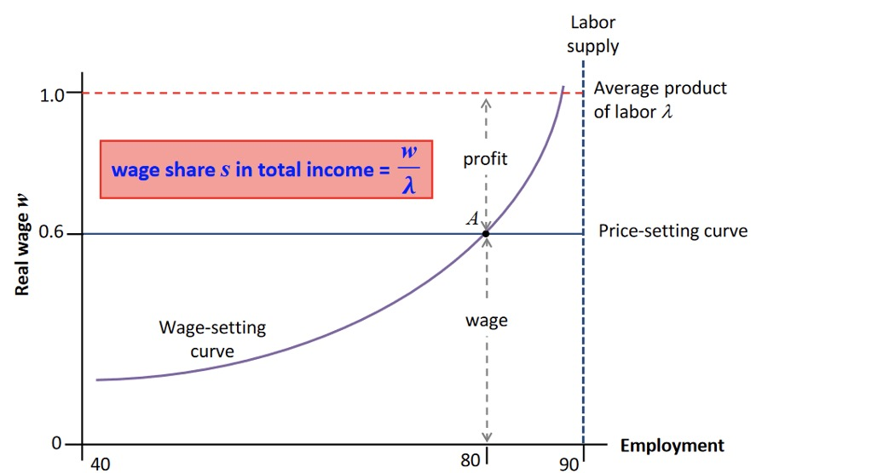
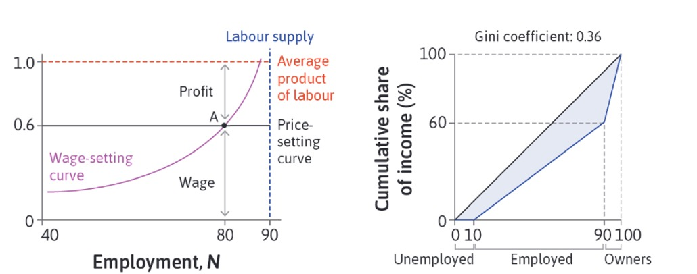

# 21.04.2023 Inequality

Labor Market = Division of Output

- employed
- unemployed
- Firm-owners

## Measuring Inequality

- Lorenz Curve: 
- Gini Coefficient: Measure of Ineq. from 0 to 1

Calculating Gini:

1. $G = \frac{1}{2*n^2*u} \sum_j \sum_i n_j * n_i * | y_j - y_i |$
2. $G = \frac{A}{A+B}$

Principles of an inequality measure

- **Anonymity** : insensitive to permutations
- **Population**: Clone / Double Population = no effect
- **Dalton**: Transfer from rich to poor = no effect
- **relative income principle**: when all incomes rise by relative amount = no effect

Lorenz for given example with workers:

