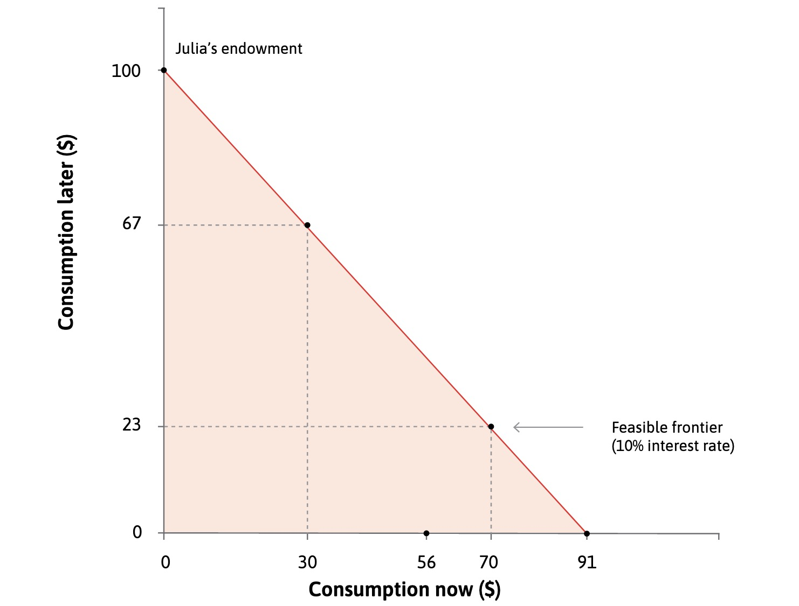
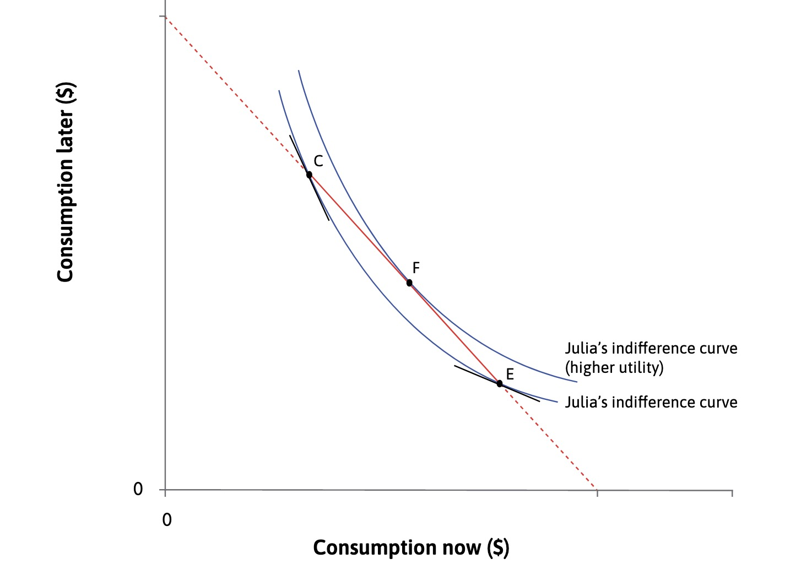
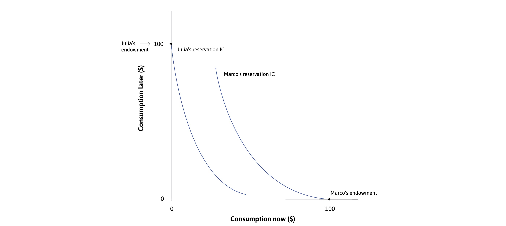
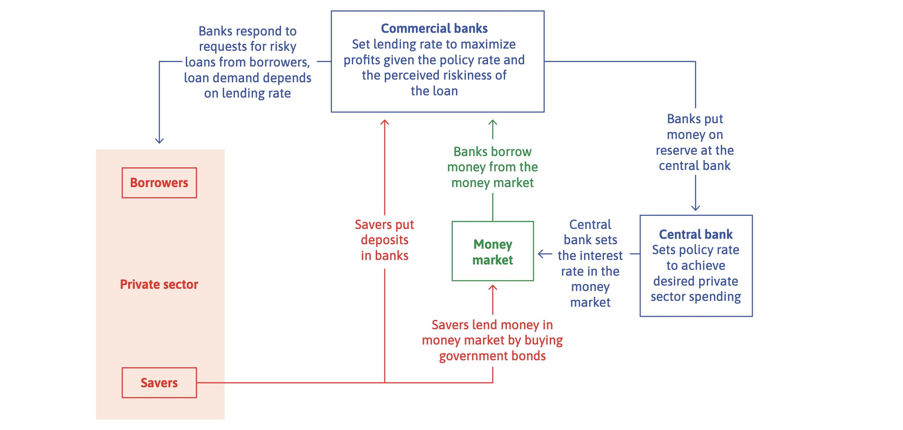

# 27.04.2023 Banks

[Chapter 10: Banks, Money and Credit Market](https://www.core-econ.org/the-economy/book/text/10.html)

Money = medium of exchange for trade (requires trust)

## Intertemporal Optimization

Borrowing brings consumtpion to Future

- r = interest rate
- tradeoff = 1+r
- Repayment = principal + interest rate
- $91 (1+r) = 100$ , with r=10%

### Decisions

based on preferences of the consumer

- individuals want to smooth consumption
- overly high consumption in one period = costly

**Impatience**: Preference for present consumption

- measured by **discount rate** 
- affected by **desire to smooth** consumption

### Equilibrium

at Point where
$$
MRS = MRT \implies 1+p = 1+r
$$
with different endowments

- Julia = 100 in future (wants to borrow)
- Marco = 100 now (wants to save)

## Balance

- Assets = what person owns

- Liabilities = what person owes

- Net Worth = Assets - Liabilites
    - not impacted by borrowing etc.!

## Banking System

Definition

> **Bank:** a firm that makes profits by lending and borrowing

> **Central Bank:** bank owned by government with money creation monopoly

Structure of the System

- **policy interest rate** = set by CB
- **bank lending rate** = banks rate on consumer loans

