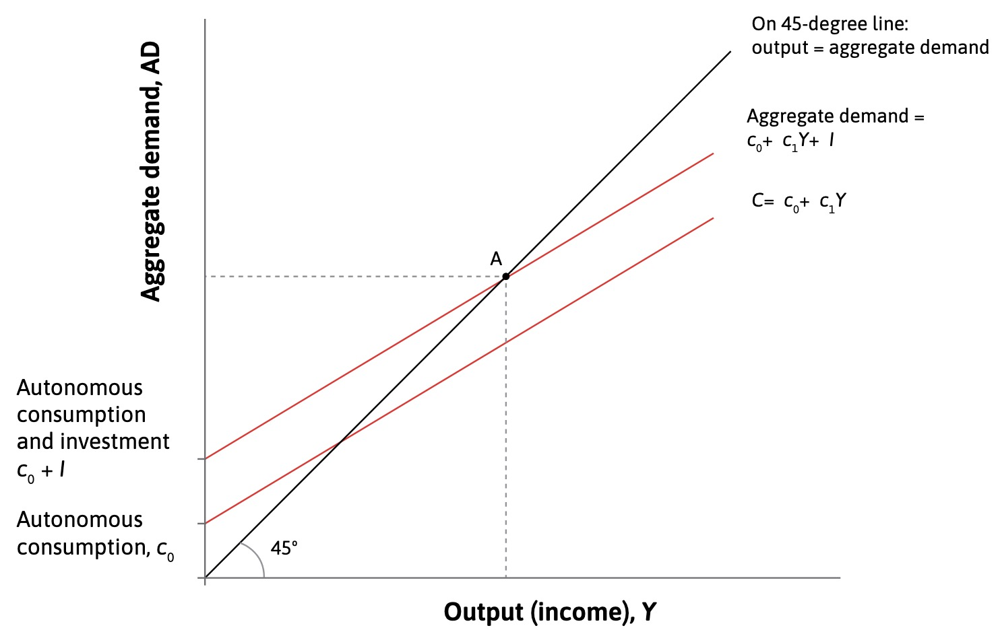
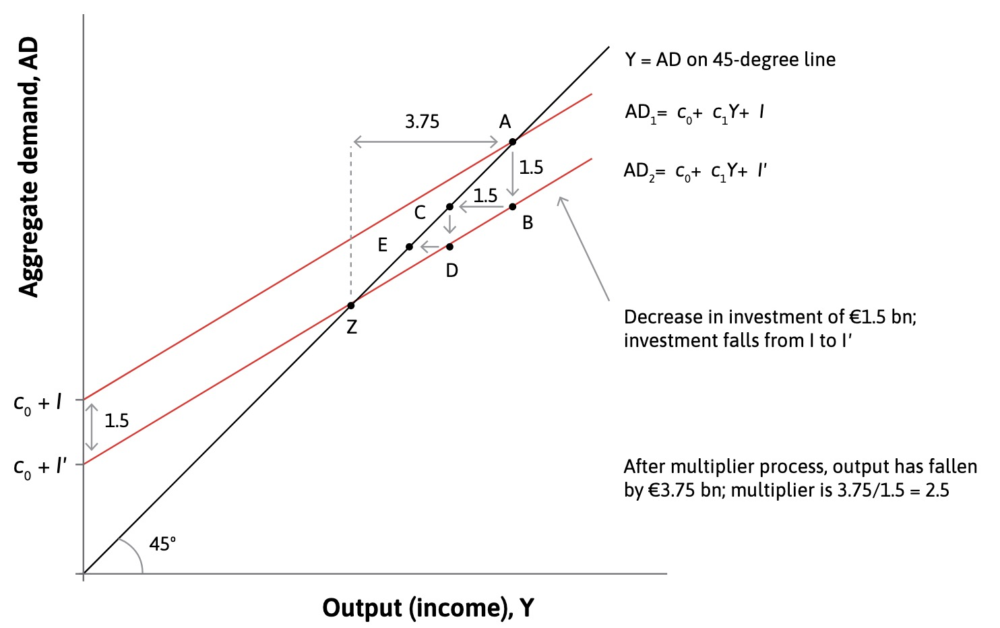
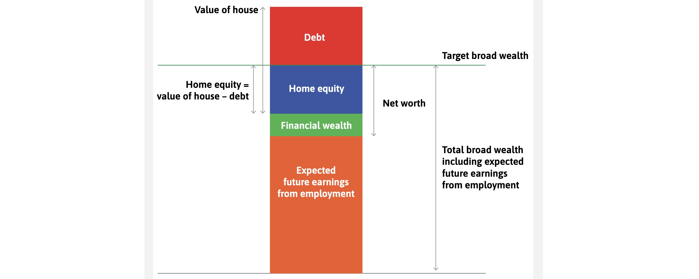

# 24.05.2023 Fiscal Policy

[Chapter 14](https://www.core-econ.org/the-economy/book/text/14.html)

How does Government Policy impact Aggregate Demand and the Business Cycle?

=> severity of Business cycle shrinked with bigger government

## Policy before Keynes

after David Ricardo:

- wages and prices adjust
- no long-term disturbances
- only role of government = avoid deficits

=> orthodox policy = austerity

> **Economics**: Allocation of scarce resources

## Policy after Keynes

*in the long run, we're all dead*

- government intervention can provide benefits to society
- due to the money multiplier
- the effect of fiscal stimulus is more than the money used for it

> **Economics**: study of how agents allocate resources and *how those choices affect society*

## Aggregate Demand

Aggregate Consumption

- autonomous consumption = fixed amount based on future income
    - slope of function = marginal propensity to consume
    - additional consumption based on more income in period etc
- 45° Line where AD = Aggregate Output
    - state of normal economy
- Investment: does not depend on output
    - added to AD Line

implicit assumption: underutilized capacity in economy

### The multiplier

A Decrease (or Increase) in Investments leads to a higher decrease in Income than the original 

- original negative investment = 1.5bn€
- expected point afterwards = C
- but households now have less money and this leads to ripple effects = Z

Determining the Multiplier

$$
Y = AD = C+I \\
= c_0 + c_1 Y+I \\ 
Y(1-c_1) = c_0+I \\
Y = \underbrace{\frac{1}{1-c_1}}_{multiplier} \times
\underbrace{c_0+I}_{autonomous \ D.}
$$

with $c_1$ = marginal propensity to consume

## Household Spending

Has *Target Wealth*: level to maintain based on expectations

optimizes *broad wealth*: assets - debt, including future earnings

> **Paradox of thrift** (Sparparadoxon): aggregate attempts of all households to increase savings during a recession does not actually increase savings

- Autonomous Consumption declines => AD curve downwards
- Income + Labor Demand declines  => Recession
- higher savings at lower income = absolute lower savings

## Firms Investments

Decicsions depend:

- Discount rate *p*
- interest rate *r*
- profit rate of investment $\Pi$

